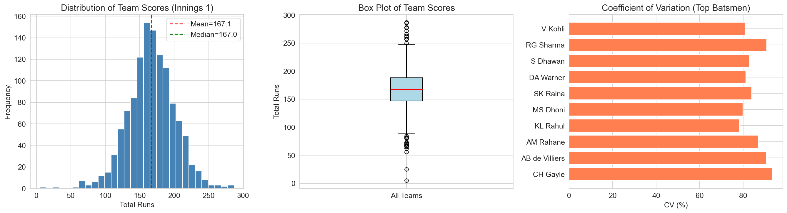
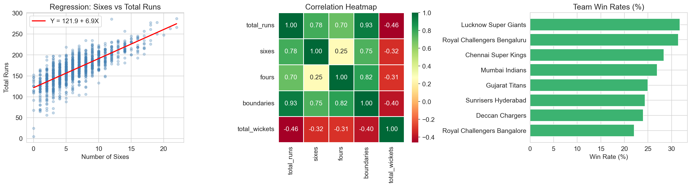
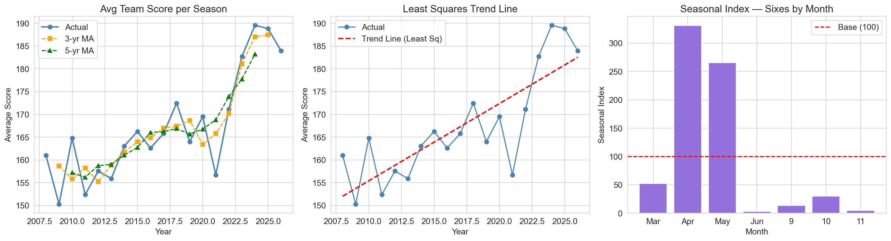
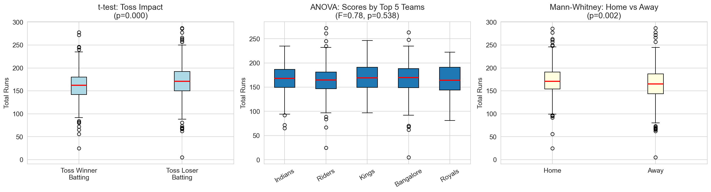
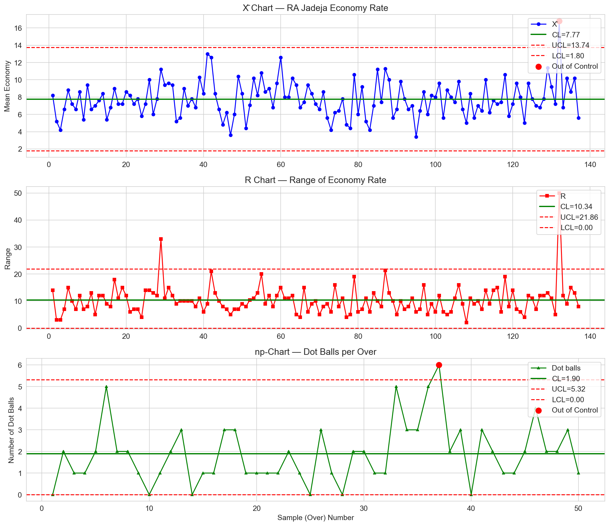

# 🏏 IPL Data Analysis (2008–2025)
### Exploratory Data Analysis using Statistical Methods


> **Course:** 22IS610 – Statistical Methods in Information Processing  
> **Department:** Information Science & Engineering  
> **Dataset:** IPL Ball-by-Ball Data (2008–2025) | 2,83,678 rows × 65 columns

---


## 📌 Project Overview

This project performs a comprehensive **Exploratory Data Analysis (EDA)** of IPL (Indian Premier League) cricket data from **2008 to 2025** using statistical methods covered in the 22IS610 curriculum.

The analysis covers all 5 units of the syllabus:

| Unit | Topic | Key Methods Used |
|------|-------|-----------------|
| 1 | Descriptive Statistics | Mean, Median, Mode, SD, Variance, Skewness, Kurtosis, CV |
| 2 | Correlation & Regression | Pearson r, Spearman ρ, Simple & Multiple Linear Regression |
| 3 | Time Series Analysis | Moving Averages, Least Squares, Seasonal Index |
| 4 | Analysis of Variance | t-test, One-Way ANOVA, Mann-Whitney U Test |
| 5 | Statistical Quality Control | X̄ & R Chart, np-Chart with UCL/LCL |

---

## 📂 Project Structure

```
IPL_Analysis/
│
├── data/
│   └── IPL.csv                        # Dataset (download separately)
│
├── ipl_env/                           # Virtual environment (don't push to GitHub)
│
├── notebooks/
│   └── IPL_EDA_Project.ipynb          # Main Jupyter notebook (all 5 units)
│
├── outputs/                           # Auto-generated when notebook is run
│   ├── unit1_descriptive_stats.png
│   ├── unit2_correlation_regression.png
│   ├── unit3_time_series.png
│   ├── unit4_hypothesis_tests.png
│   └── unit5_control_charts.png
│
└── README.md                          # This file
```

---

## 📊 Dataset

**Source:** [IPL Dataset (2008–2025) on Kaggle](https://www.kaggle.com/datasets/chaitu20/ipl-dataset2008-2025)

**File:** `IPL.csv` (110 MB) — Ball-by-ball breakdown of every IPL match

> ⚠️ The dataset is not included in this repository due to its size.  
> Download it from Kaggle and place `IPL.csv` in the root project folder.

**Key Columns Used:**

| Column | Description |
|--------|-------------|
| `match_id` | Unique match identifier |
| `date`, `year`, `month`, `season` | Temporal information |
| `batting_team`, `bowling_team` | Team names |
| `runs_batter`, `runs_total` | Ball-level run data |
| `valid_ball`, `striker_out` | Delivery and wicket info |
| `toss_winner`, `toss_decision` | Toss data |
| `venue`, `city` | Match location |
| `bowler`, `batter` | Player names |

---

## ⚙️ Setup & Installation

### 1. Clone the repository
```bash
git clone https://github.com/yourusername/ipl-eda-stats.git
cd ipl-eda-stats
```

### 2. Create a virtual environment
```bash
python -m venv ipl_env

# Activate — Windows
ipl_env\Scripts\activate

# Activate — Mac/Linux
source ipl_env/bin/activate
```

### 3. Install dependencies
```bash
pip install jupyter pandas numpy matplotlib scipy seaborn statsmodels openpyxl ipykernel
```

### 4. Register the kernel
```bash
python -m ipykernel install --user --name=ipl_env --display-name "IPL Project"
```

### 5. Download the dataset
Download `IPL.csv` from [Kaggle](https://www.kaggle.com/datasets/chaitu20/ipl-dataset2008-2025) and place it in the project root folder.

### 6. Launch Jupyter
```bash
jupyter notebook
```
Open `IPL_EDA_Project.ipynb` → Select kernel **"IPL Project"** → **Run All Cells**

---

## 📈 Analysis Highlights

### Unit 1 — Descriptive Statistics
- Computed **Arithmetic, Geometric, and Harmonic Mean** of team scores
- Measured **Skewness** and **Kurtosis** of score distributions
- Used **Coefficient of Variation** to compare consistency of top batsmen across seasons

### Unit 2 — Correlation & Regression
- **Pearson correlation** between boundaries hit and total runs scored
- **Spearman rank correlation** between team win rate and matches played
- **Simple linear regression**: predicts total runs from number of sixes
- **Multiple regression** (OLS): total runs ~ sixes + fours + wickets lost

### Unit 3 — Time Series
- Season-wise trend of average team scores from 2008 to 2025
- **3-year and 5-year moving averages** to smooth fluctuations
- **Least squares trend line** fitted to identify long-term scoring patterns
- **Seasonal index** of sixes hit per month using simple average method

### Unit 4 — Hypothesis Testing
- **t-test**: Does the toss-winning team score significantly more runs?
- **One-way ANOVA**: Are mean scores significantly different across top 5 teams?
- **Mann-Whitney U test**: Non-parametric comparison of home vs away team scores

### Unit 5 — Statistical Quality Control
- **X̄ & R Control Chart**: Monitor economy rate consistency of the most prolific IPL bowler
- **np-Chart**: Track number of dot balls per over across 50 sample overs with UCL/LCL

---

## 📉 Sample Outputs

| Chart | Description |
|-------|-------------|
|  | Score distribution, box plot, CV comparison |
|  | Scatter + regression, heatmap, win rates |
|  | Trend + moving averages, seasonal index |
|  | Box plots for all 3 hypothesis tests |
|  | X̄ chart, R chart, np-chart |

> Run the notebook to generate these plots in your local `outputs/` folder.

---

## 🧰 Libraries Used

| Library | Purpose |
|---------|---------|
| `pandas` | Data loading, cleaning, aggregation |
| `numpy` | Numerical computations |
| `matplotlib` | Plotting charts and graphs |
| `seaborn` | Heatmaps and styled plots |
| `scipy` | Statistical tests (t-test, ANOVA, Mann-Whitney) |
| `statsmodels` | Multiple regression (OLS) |

---

## 📚 References

- **Dataset:** [IPL Dataset (2008–2025) — Kaggle](https://www.kaggle.com/datasets/chaitu20/ipl-dataset2008-2025)
- **Textbook:** Fundamentals of Mathematical Statistics — S.C. Gupta & V.K. Kapoor, 12th Edition, Sultan Chand & Sons, 2020
- **Textbook:** Statistics for Technology — C. Chatfield, 3rd Edition, 1999
- **Course:** 22IS610, B.E. Information Science & Engineering, VTU

---

## 📝 License

This project is for academic purposes under the MIT License.  
Feel free to use or reference with proper attribution.
